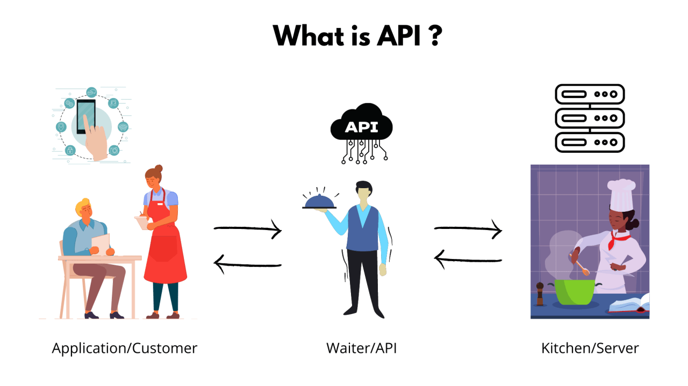

---
# try also 'default' to start simple
#theme: seriph
theme: seriph
# random image from a curated Unsplash collection by Anthony
# like them? see https://unsplash.com/collections/94734566/slidev
background: https://source.unsplash.com/collection/94734566/1920x1080
# apply any windi css classes to the current slide
class: 'text-center'
# https://sli.dev/custom/highlighters.html
highlighter: shiki
# show line numbers in code blocks
lineNumbers: false
# some information about the slides, markdown enabled
info: |
  ## Slidev Starter Template
  Presentation slides for developers.

  Learn more at [Sli.dev](https://sli.dev)
# persist drawings in exports and build
drawings:
  persist: false
---

# GraphQL 101

## An Introduction to Query Language for API's

Kamil Kulig

---
layout: two-cols
---

# agenda

<v-clicks>

* about me
* motivation
* roadmap 
* definition
* compare to other tech
* shines as diamonds
* tools
* challenges
* next steps

</v-clicks>

<!-- SPEAK SLOWLY -->

---
layout: two-cols
---

# about me

<v-clicks>

* fullstack developer leader in Schneider Electric 💚
* team leader 🐼🐯🐸🦊🐰🐱🐻
* fullstack developer 👨‍💻
* python & typescript lover 🐍
* eternal optimist 😎
* romantic programmer 🌹
* sport freak ⚽️🏀🏈🥊
* lego fanatic 🧩

</v-clicks>

::right::

---
layout: two-cols
---
# motivation

<v-clicks>

* Maciej Morawski - Speech Recognition with Python

* Sinem Ayyaldaz, ME - (workshop) End-to-end Discord bot development and deployment

* Marcin Brzezinski - (workshop) Introduction to functional programming

* Michal Korzycki - Python the missing bits. Practical application of Metaprogramming

</v-clicks>

::right::

<!-- 
I Leader and I always motivate team  
as a SE we did 3 leactures and 2 workshops  
I hope you one of our prestation or workshop  
this is motivation for be in pycon  
one ago we been in audience   
and now we speakers  
if you didn't see some of our presentation I recommend that  
FRONTEND GUY  
The only place where success comes before work is in the dictionary.   
Ruslan Korniichuk his is inspiration for US  
MY motivation is to learn every day and inspire people.
 --->

---
layoyt: center
---

# Roadmap for GraphQL
https://roadmap.sh/graphql

<!-- 
You need to check this out roadmap for diffrent technologies, 
they not perfect but sooo prettty -->
---
layout: two-cols
---

# GraphQL 
## graph query language for APIs

 
<v-clicks>

* GQL != GraphQL = Graph Query Language
* created by facebook in 2012 
* presented in 2015 at React.js conference 
* documentary by HoneyPod about GraphQL https://www.youtube.com/@Honeypotio 
* Github started officially use GraphQL in September 14, 2016 https://github.blog/2016-09-14-the-github-graphql-api/

</v-clicks>

<!--
it's not new technology  

Graph than we go to Query Languege for API  
We will start from the end of the definition for API 
from documentary, one of the biggest staff for creator was that the other big dog without facebok use the GraphQL was Github  
In my opinion is the easiest way to understand basics in graphql is use Github GraphQL API
We will start from the end of the definition for API -->
---
layout: two-cols
---

# API as restaurant
 

::right::

<v-clicks>

</v-clicks>
<!-- 
when I need to explain what is API, imagine no IT no tech person  
I use this metafor with restaurant  
client is client, browser, frontend  
kichean - server,  
ingredients - database  
waiter is the for Example REST API, probably you know this  
where is graphQL  
in 90% restaurant you get the order, starter and thing about main dish, then main, and last desert  
GraphQL you have menu and take starter, main and desert once, 
 and you component what you imagine from components, I want rice with chicken and chocleate --->

---
layout: center
---

# graph

<!-- 
 -->
<v-clicks>

 

</v-clicks>
<!-- 
when you want to get some data, you walk on graph  
for example github graph  
nodes: points 
node is organistation, etc 
edges are lines, relationships between nodes -->

---
layout: two-cols
---

# query language

 

<v-clicks>

https://graphql.org/learn/

</v-clicks>

::right::

<v-clicks>

</v-clicks>
<!-- 
* think query 
* select name, or * from organisations  
* operation, operation name, variables
* fileds, arguments
* for example when we want to go dep in  organisation  
* in moment we will go for more details dont worry about that  
* This is definition about query language for APIs    --->

---
layout: two-cols
---

# technologies for API's 

 

<v-clicks>

Article: https://wundergraph.com/blog/graphql_rest_openapi_trend_analysis_2023

</v-clicks>

::right:: 

<!-- 
* GraphQL finds some place 
* for example when we want to get some organisation --->

---
layout: two-cols
---

# compare with REST

<!-- <v-clicks> -->
 

<!-- </v-clicks> -->

::right:: 

<v-clicks>

Images from https://www.howtographql.com/

</v-clicks>

<!-- https://www.howtographql.com/ -->
---
layout: two-cols
---

# shining 💎

<v-clicks>

* over-fetching 

* under-fetching

* multi clients

* when you have nested data or graph database

* provide performance benefits by reducing the number of network requests

</v-clicks>

::right:: 

<!-- Sending data for user every kilobajt -->

<v-clicks>

</v-clicks>

<!--
* Clients might receive more data than they need (over-fetching) or 
* might need to make multiple requests to fetch all required data (under-fetching)  
*  shine If you need integrate with server to serrver
*   if don't need something You need to delete from client side
*   otherwise backend need to do some staff, fight for fronteds
*   multi clients web app, mobile, watch
*    --->

---
layout: two-cols
---

# as a client use Github API

<v-clicks>

GraphiQL is a graphical interactive in-browser GraphQL IDE.

</v-clicks>

::right:: 

<v-clicks>

https://docs.github.com/en/graphql/overview/explorer

</v-clicks>

<!-- * client first frontend first technologie
* interact with a GraphQL API

- build queries,  
- preview responses  
- autocompleted   
- documentation Tool like Swagger for REST   --->

---
layout: two-cols
---

# server side 
 
Strawberry vs Graphane vs Ariadne

<v-clicks>

2 approches: 

**schema-first** - describe GraphQL **Schema Definition Language (SDL)** - ariadne

**code-first** - code describe data: strawberry and graphane

</v-clicks>

::right::

<v-clicks>

https://github.com/strawberry-graphql

</v-clicks>
<!-- 
for me it's like graphane is like flask 
strawberyy in other hand is fastapi
  -->

---
layout: two-cols
---
# strawberry 🍓

new GraphQL library for Python 3, inspired by dataclasses

 

<v-clicks>

playground: https://play.strawberry.rocks/

</v-clicks>

::right:: 

<v-clicks>

examples: https://github.com/strawberry-graphql/examples/

fastapi + sqlalchemy: https://github.com/strawberry-graphql/examples/tree/main/fastapi-sqlalchemy

docs: https://strawberry.rocks/

</v-clicks>

<!-- 
* One problem for it still pydentic experimental
 -->

---
layout: two-cols
---

# hammer time
 

<v-clicks>

When you have hammer, each problem looks like a nail.

First be familiar with technology!

</v-clicks>

::right:: 

<!-- 
* What problem we have?

* When you have hammer, all problem looks like nails.
* familiarity with technology
 -->

---
layout: two-cols
---

# challenges

<v-clicks>

* cost for query

* N+1 problem

* monitoring  

* pagination

* depth limiting 

* resolver access for data

* recommend presentation by Jakub Bacic "How to create a production ready GraphQL server"

</v-clicks>

<!-- 
Over-fetching is fetching too much data, meaning there is data in the response you don't use.  

Under-fetching is not having enough data with a call to an endpoint, forcing you to call a second endpoint. -->
---
layout: two-cols 
---

# next steps 

<v-clicks>

* go to gitub API explorer https://docs.github.com/en/graphql/overview/explorer
* check roadmap https://roadmap.sh/graphql
* check presentation & like repository on my github https://github.com/KuligKamil/GraphQL-101-PyCon2023PL
* write your opinion or suggestion about presentation
  
</v-clicks>

<!-- TRY IT Smell It, Lick It, Taste It, Kiss It, Touch It DO IT -->

---
layout: two-cols
---

# Slides and Links 

<v-clicks>

https://github.com/KuligKamil/GraphQL-101-PyCon2023PL

</v-clicks>

::right::

Github

---
layout: two-cols
---

# Questions?

Linkedin

::right::

